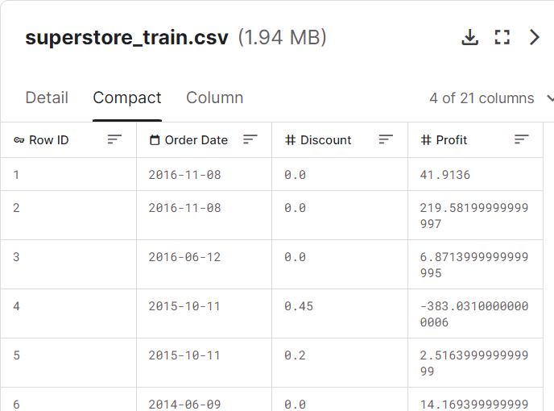
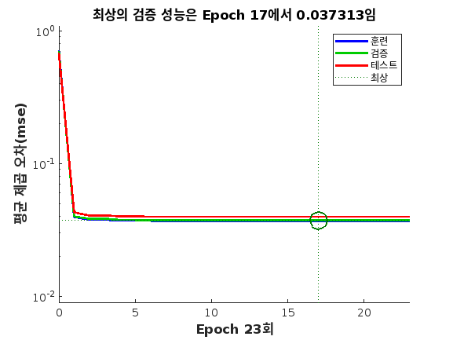
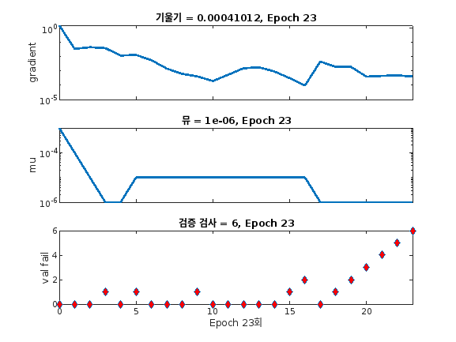

## NARX로 시계열 분석하기

#### (SuperStore Time Series Dataset - Kaggle)

---

## Overview

"과연 마트의 할인률 변동은 시간에 영향을 받을까?"

---

### Data Set

[SuperStore Time Series Dataset - Kaggle](https://www.kaggle.com/datasets/blurredmachine/superstore-time-series-dataset/data?select=superstore_train.csv)

- Order Date: 주문 날짜 데이터,
  2014.01.03 - 2017.12.30
- Discount: 할인률
- Profie: 주문에 대한 순익

---

## NARX 소개

#### NARX의 특징

1. 순환신경망: 시계열 데이터 예측
2. 자기회귀: **과거의 값으로부터 현재의 값 예측**
3. 지연: 과거의 어느 시점까지 데이터를 사용할 지 결정

---

## 구현 내용

  

    
    성능 평가
  

  

    
    학습 과정
  
  

---

## 결론

-
- 순환 신경망의 한 갈래인 NARX를 사용해보면서 신기했다

