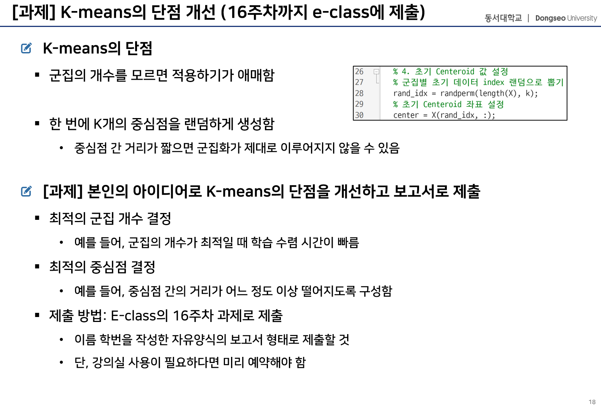

# AI모델분석및설계 101분반 (과제)

## 과제 정보

## Ideas

- Elbow method 도입:
  군집의 수 $k$를 바꾸면서 군집화를 수행하여 최적의 $k$ 탐색
- 최적의 중심점 결점: 초기값 지정 방식 변경:
  초기값으로 랜덤한 난수가 아닌 PCA(주성분분석) 또는 LDA(선형판별분석)을 어느 정도 최적화된 값을 사용하도록 변경

## 프로젝트 구조

- [test](./test): 테스트를 위해 작성한 여러 실습 및 테스트 코드 파일 뭉치입니다.
- [Airline Passenger Satisfaction | Kaggle](https://www.kaggle.com/datasets/teejmahal20/airline-passenger-satisfaction/) 데이터 관련
  - [origin_dataset](./origin_dataset/): 원본 [Airline Passenger Satisfaction](https://www.kaggle.com/datasets/teejmahal20/airline-passenger-satisfaction/) 데이터셋입니다.
  - [dataset](./dataset/): Matlab에서 사용하고자 모든 데이터를 정수 및 실수 범위로 정규화 한 데이터셋입니다.
  - [normalize.py](./normalize.py): `origin_dataset`의 원본 데이터를 `dataset`의 데이터로 정규화할 때 사용한 코드입니다.
- 과제 제출물
  - [kmeans_basic.m](./kmeans_basic.m): K Means 시연 코드입니다
  - [kmeans_basic_wss.m](./kmeans_basic_wss.m): K Means의 WCSS 계산을 위해 사용한 코드입니다
  - [kmeans++.m](./kmeans++.m): K Means++ 시연 코드입니다
  - [kmeans++\_wss.m](./kmeans++_wss.m): K Means의 WCSS 계산을 위해 사용한 코드입니다
  - [elbow_method.m](./elbow_method.png): Elbow Method 시연 및 이미지 생성을 위해 사용한 코드입니다
  - [pca.m](./pca.m): PCA 사용를 사용한 K Means 중심점 초기화 시연에 사용한 코드입니다
  - [basic-k-means-wss.png](./basic-k-means-wss.png): K Means의 WCSS 시각화 이미지입니다
  - [k-means-++-wss.png](./k-means-++-wss.png): K Means++의 WCSS 시각화 이미지입니다
  - [elbow_method.png](./elbow_method.png): Elbow Method 시연 이미지입니다

## Reference

- [K-Means 클러스터링 군집 개수 정하는 방법은?! | 테리엇의 A Python Lab](https://aplab.tistory.com/entry/%EA%B5%B0%EC%A7%91-%EA%B0%9C%EC%88%98)
- [10. ROC Curve | 공부하려고 만든 블로그](https://welcome-to-dewy-world.tistory.com/11)

> **AI 답변**
>
> Q. "Elbow method의 원리에 대해 설명해줘"
>
> 'Elbow method'는 클러스터링 알고리즘에서 최적의 클러스터 개수를 결정하는 방법 중 하나입니다. 특히 K-means 클러스터링에서 많이 사용되며, 이는 클러스터 개수(K의 값)에 따른 Within-Cluster-Sum-of-Squares(WCSS)를 그래프로 그려보면, 그래프가 팔꿈치처럼 꺾이는 지점이 최적의 클러스터 개수라는 아이디어를 기반으로 합니다.
>
> WCSS는 클러스터 내의 모든 점들이 클러스터의 중심으로부터 얼마나 멀리 떨어져 있는지를 측정한 값입니다. 클러스터 개수(K)가 증가하면 WCSS는 감소하게 되는데, 이는 클러스터 개수가 많아질수록 각 클러스터의 점들이 클러스터 중심에 더 가깝게 모이기 때문입니다.
>
> 하지만 클러스터 개수를 무작정 늘리는 것은 과적합(Overfitting)을 일으킬 수 있습니다. 따라서 적절한 클러스터 개수를 찾기 위해 Elbow method를 사용하는데, 이는 WCSS가 급격하게 감소하다가 완만하게 감소하는 '팔꿈치'와 같은 지점, 즉 WCSS의 감소 속도가 완만해지는 지점을 찾는 것입니다. 이 지점이 바로 최적의 클러스터 개수로 간주됩니다.
>
> 이 방법의 한계는 '팔꿈치' 지점이 명확하지 않은 경우가 많다는 점입니다. 이런 경우에는 다른 방법들(Silhouette method, Gap statistic 등)을 사용하여 최적의 클러스터 개수를 결정하게 됩니다.
>
> _References_
>
> - [[ML] 군집화 - 실루엣 분석 (Silhouette Analysis) | @gangjoo](https://velog.io/@gangjoo/ML-%EA%B5%B0%EC%A7%91%ED%99%94-%EC%8B%A4%EB%A3%A8%EC%97%A3-%EB%B6%84%EC%84%9D-Silhouette-Analysis)
> - (`Gap statistic` 자료 찾을 수 없음)
