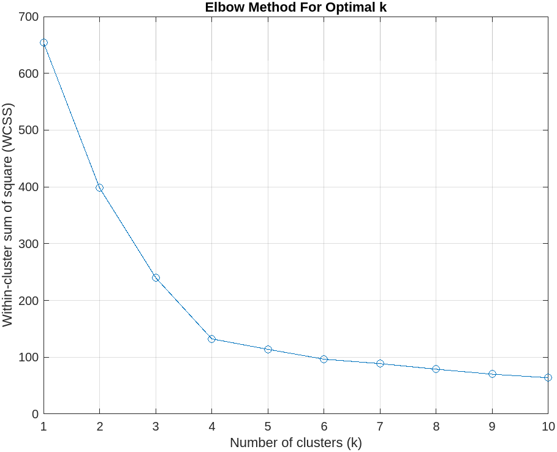
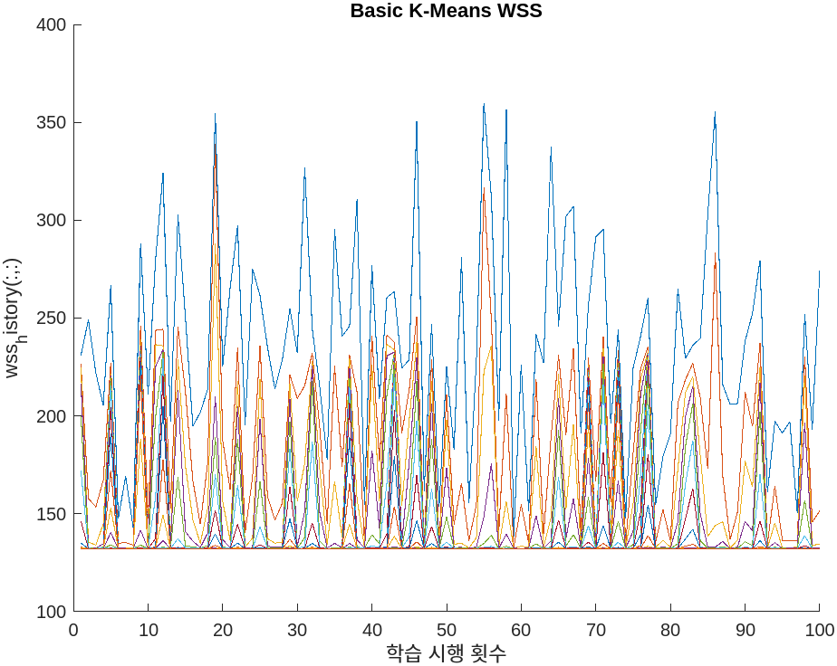
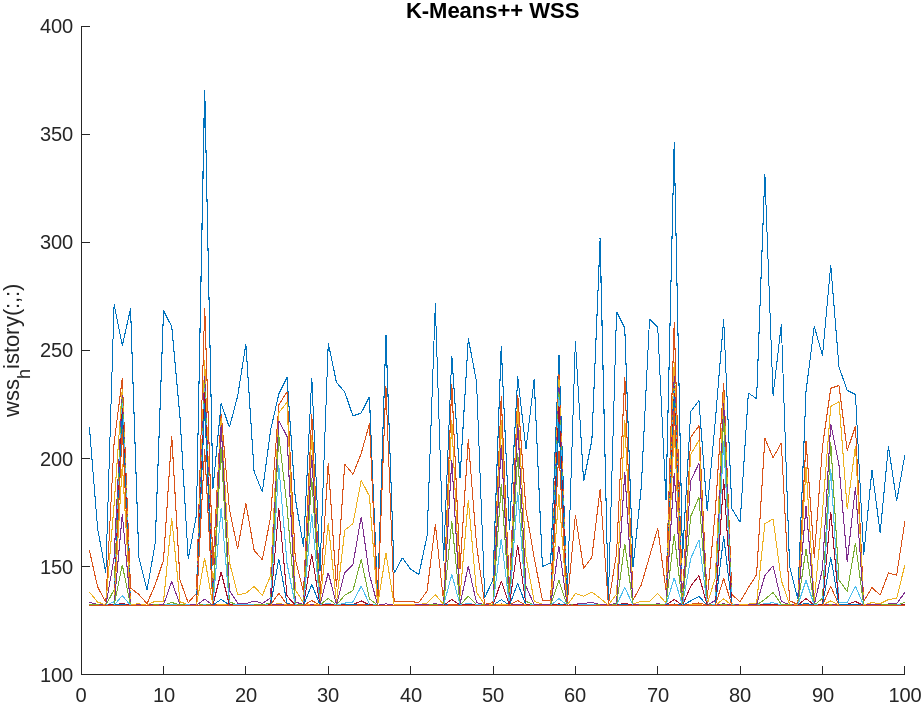

## 개요

본 문서는 Elbow method를 통한 최적 군집 개수 정의, PCA 및 LDA를 통한 최적 군집 개수 정의 로직을 추가한 K Means 군집화 알고리즘의 개선안을 제안합니다.

## 개선안

- Elbow method 도입: [군집 수 k 최적화: Elbow Method (팔꿈치 방법 적용)](#군집-수-최적화-elbow-method-팔꿈치-방법-적용)
- PCA 도입: 중심점 지정 방법 개선: [초기 중심점 최적화: PCA 적용](#초기-중심점-최적화-pca-적용)
- K Means++ 도입: [초기 중심점 최적화 2: K-Means++](#초기-중심점-최적화-2-k-means)
  - [K Means++ vs K Means 수렴에 걸리는 연산 횟수 비교](#k-means-vs-k-means-수렴에-걸리는-연산-횟수-비교)

### 군집 수 k 최적화: Elbow Method (팔꿈치 방법 적용)

K Means 군집화를 사용할 때 L2-norm을 통해 각 군집의 밀집도를 계산할 수 있습니다. 이를 WCSS(Within Cluster Sum of Square)라고 합니다.
WCSS는 각 군집의 중심점과 해당 군집에 속한 모든 점 사이의 거리를 L2-norm으로 구한 것입니다.

WCSS를 사용하면 k의 변화에 따른 각 군집의 밀집도 변화를 구할 수 있는데 일반적으로 k가 커짐에 따라 WCSS가 낮아집니다.
Elbow method는 k를 조금씩 증가시키면서 WCSS가 어떠한 값으로 수렴될 때의 k를 구하는 방법인데
k의 증가에 따른 WCSS의 변화를 그래프로 그릴 때 팔꿈치 모양의 그림이 나와서 Elbow method, 팔꿈치 방법이라고 부릅니다.

실제로 `simplecluster_dataset`에 Elbow method를 사용하며 다음과 같은 그래프가 나옵니다.

  

Elbow method의 목적은 팔꿈치가 되는 지점을 찾는 겁니다. 위에서는 k=4 지점이 팔꿈치에 해당합니다.

### 초기 중심점 최적화: PCA 적용

이 방법은 PCA를 통해 데이터셋의 주성분을 분석하여 초기 중심점을 지정하는 방식입니다.
PCA를 통해 얻을 수 있는 데이터는 크게 `coeff`, `score`, `latent`가 있는데, 이 방법은 일반적으로 특징 좌표계의 차원이 데이터셋의 차원 수 d를 넘어서는 경우에 초기 중심점을 계산할 수 없습니다.

입력 데이터의 차원수가 2라면 k가 2보다 커질 수 없습니다.

### 초기 중심점 최적화 2: K-Means++

K-Means++ 군집화 알고리즘은 초기 중심점의 거리를 최대화하는 방법입니다.
초기 중심점을 정할 때 첫 중심점은 랜덤으로, 그 다음 중심점부터는 과거에 지정된 중심점 간의 거리를 고려하여 확률적으로 멀리 있는 변수를 선택합니다.

K-Means++ 군집화 알고리즘은 초기 단계의 군집 겹침 현상 감소, 군집화 정확도 향상을 기대할 수 있습니다.

#### K Means++ vs K Means 수렴에 걸리는 연산 횟수 비교

아래 그래프는 일반 K-Means와 K-Means++를 iteration 100으로 설정한 후 군집화를 각각 100번 시행하면서 발생하는 WCSS 변동을 시각화 한 것입니다.
단, 그래프를 보는데 방해되어 범례 `legend`는 제거하였습니다.

아래 그래프를 보면 일반 K-Means에 비해 K-Means++의 peak, 흔히 말하는 '확 튀는 부분'이 적고, 그래프가 전체적으로 비교적 낮은 경향이 있음을 보입니다.

이는 위에서 언급한대로 K-Means++ 알고리즘을 사용하면 군집화 정확도 향상을 기대할 수 있음을 시사합니다.

  
  

